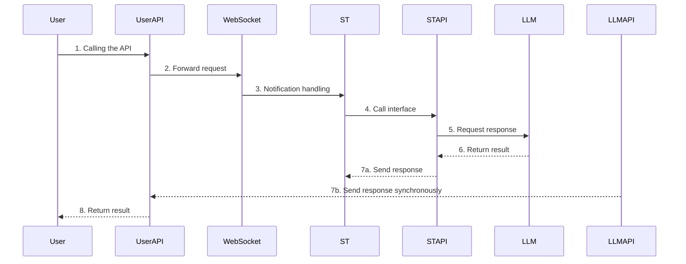

# Full Traanslate in English

# SillyTavern Extension - ChatBridge 
An API bridging extension for SillyTavern that allows external applications to reuse SillyTavern's conversation functionality, enabling chat in SillyTavern as if calling an API.

Introduction

> *I'm pleased to announce that I have completed the main features of this project. This is the latest update, completely different from previous versions. I've restructured the basic functionality and implemented an OpenAI-format API for external use, suitable for any OpenAI application to leverage SillyTavern's powerful capabilities.*

This project is a SillyTavern extension that turns SillyTavern into a middleware service through WebSocket and API forwarding. It consists of the following components:

- SillyTavern UI Extension: Responsible for communication with the WebSocket server
- ChatBridge_APIHijackForwarder.py: Core server component, providing WebSocket and API interfaces
- Configuration files: Used to set various connection parameters

This extension allows any external application that supports the OpenAI API format to interact with LLMs through SillyTavern's conversation management system.

## Usage Instructions

### 1. Install the Extension

1.    Copy the project files to the SillyTavern extension directory:
```bash
/public/scripts/extensions/third-party/SillyTavern-Extension-ChatBridge/
```

### 2. Start the Service

0. You may need to configure the base_url and apikey for various APIs in the settings.json file.

1.    Start the Python server:
```bash
python ChatBridge_APIHijackForwarder.py
```

2. Configure and connect to WebSocket in SillyTavern extension settings:

- Set the server address (default: localhost)
- Set the port (default: 8001)
- Click the "Connect" button

### 3. External Application Calls

Configure the API settings for external applications, for example:
```python
client = OpenAI(
    api_key="your-user-api-key",
    base_url="http://localhost:8003/v1"
)
```

## Internal Logic

Request flow:
1. External App → User API(8003) → WebSocket(8001)
2. WebSocket → SillyTavern UI Extension
3. SillyTavern processing → ST API(8002)
4. ST API → LLM API → Get response
5. Response returned to both ST and User API



### Important Notes

- Requires the latest version of SillyTavern with support for `context.clearChat()` and `context.printMessages()`
- All APIs use OpenAI format
- Supports both streaming and non-streaming responses, **but ensure that ST settings and application settings are consistent for streaming/non-streaming**
- Supports multiple LLM API keys rotation

## Dependencies

- Python 3.7+
- Latest version of SillyTavern
- aiohttp
- websockets

## License

This project is licensed under AGPL-3.0

## Known issues

- If the request for USERPI is sent when the response to the previous message is not completely over, there is a high probability that another request will get the same reply.
  That is, the repeater design bug makes USERPI give the same copied response to short-term requests, and will be fixed in future versions. This bug does not affect the serial use of stand-alone machines.
